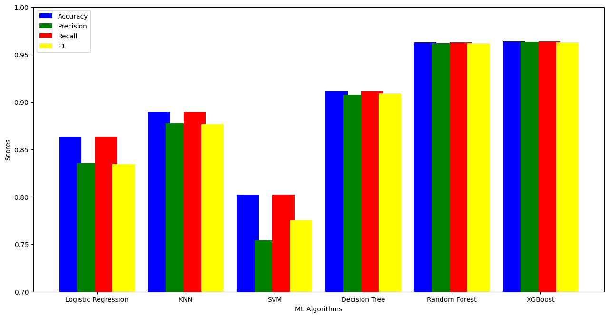

# Project Overview
In this project, I created an artificial neural network with Keras to predict customers that will churn from a company.

The  `churn_modelling_with_ann.ipynb` notebook contains code to predict customers that will churn from a bank. The `customer-churn` dataset was retrieved from the Kaggle repository.

The  `Telcom_customer_churn.ipynb` notebook contains code to predict customer churn from s telecommunication industry. The `SyriaTel` dataset was used for this part of the project.
Full documentation [here](https://docs.google.com/document/d/1iTzE5IaBaH0Bok__YcEkCfNt8kSNXVfgCu_wZNCW7fY/edit?usp=sharing).

## Customer Churn Prediction for Telecommunication Report

The goal of the project is to use machine learning to predict customer churn from a telecommunication company. That is, predicting whether a customer will change telecommunications provider. The SyriaTel dataset was used for this project. The dataset consists of 3333 records of customers and 32 columns.

Figure 1: Pie chart showing the percentage of customers that churned vs customers that didn’t churn in the dataset.

The dataset consists of 2850 records of customers that did not churn. It contains 483 records of customers that churn. The dataset is imbalanced because it has more data on customers that did not churn than on customers that churned.

### Exploratory Data Analysis
Exploratory data analysis is carried out using the Pandas-Profiling library. From the overview above, there are no missing values. The visualization above shows that none of the variables have missing values. They all have 3333 samples. The images below show the analysis of each of the columns in the dataset.

The ‘phone number’ column has a cardinality of 100%. This means all the values in that column are unique. It doesn’t have any information that will help us determine if a customer will churn or not. We won’t use this variable as a feature.

Figure 6: Pearson Correlation of Features in the Dataset using Seaborn

The Seaborn library is used to show the Pearson Correlation of features in the dataset. Pearson Correlation is given as:

From the Seaborn Heatmap, we see that the total day minutes column is highly positively correlated with the total day charges. Total evening minutes is highly positively correlated with total evening charges. Total night minutes is highly positively correlated with total night charges. Total intl minutes is highly positively correlated with total intl charges. 

### Data Cleaning
This first step of data pre-processing (cleaning) is to remove irrelevant features. The features I used are 'international plan', 'voice mail plan', 'number vmail messages', 'total day minutes', 'total day calls', 'total day charge', 'total eve minutes', 'total eve calls', 'total eve charge', 'total night minutes', 'total night calls', 'total night charge', 'total intl minutes', 'total intl calls', 'total intl charge', 'customer service calls'.

The next step is to separate the features and the target variable. The “churn” column is our target variable. It is what we are trying to predict. 

We have to convert the boolean values in the international plan and voice mail plan columns to numbers. We apply ordinal encoding here. These values must be converted to numbers before we can start training the machine learning algorithms on the data.

We perform label encoding to convert the categorical variables in the target column to numbers. The number 0 represents the false class [customers that did not churn]. While the number 1 represents the true class [customers that churn]. 

The dataset is split into the training and validation set. 75% of the data was used for training and 25% was used for validation. There are 2499 records in the training set and 834 records in the validation set. The last step in the data-cleaning process is feature scaling. The method of feature scaling used is standardization. Standardization is applied to the training set and test set to keep all the features on the same scale. It also helps to speed up the training process. The formula for standardization is shown below. 
x =[x − mean(x)]/standard deviation(x) 

### Training Model
I trained six machine learning algorithms on the training data. The algorithms include Logistic Regression, K Nearest Neighbors (KNN), Support Vector Machine (SVM), Decision Tree, Random Forest and XGBoost

### Results
For the training and validation results, we focus on the F1 score metric. This is because the dataset is imbalanced. Accuracy will not be efficient on a dataset with imbalanced classes. We will use the accuracy, precision, recall, and f1-score metrics to evaluate the test set.

#### Validation Results
20% of the data was kept aside for use as a validation set. The result of each model on the validation set is shown below. The confusion matrix is also shown below.
The top two models are the XGBoost model and the Random Forest model.          

## Confusion Matrix Plots
The confusion matrix shows the number of true positives, false positives, true negatives, and false negatives.

Our class of interest is the ‘Churned’ class. The logistic regression model correctly classified 25 customers that churned. It misclassified 18 customers as churned, whereas the customers did not leave. It correctly classified 695 customers as retained. It misclassified 96 customers as retained, whereas they actually churned.

The KNN model correctly classified 49 customers that churned. It misclassified 20 customers as churned, whereas the customers did not leave. It correctly classified 693 customers as retained. It misclassified 72 customers as retained, whereas they actually churned.

The SVM model correctly classified 10 customers that churned. It misclassified 54 customers as churned, whereas the customers did not leave. It correctly classified 659 customers as retained. It misclassified 111 customers as retained, whereas they actually churned.

The Decision Tree model correctly classified 77 customers that churned. It misclassified 30 customers as churned, whereas the customers did not leave. It correctly classified 683 customers as retained. It misclassified 44 customers as retained, whereas they actually churned.

The Random Forest model correctly classified 99 customers that churned. It misclassified 9 customers as churned, whereas the customers did not leave. It correctly classified 704 customers as retained. It misclassified 22 customers as retained, whereas they actually churned.

The XGBoost model gave us the lowest number of false positives and the highest number of true negatives. While the random forest model gave us the lowest number of false negatives and the highest number of true positives. 

